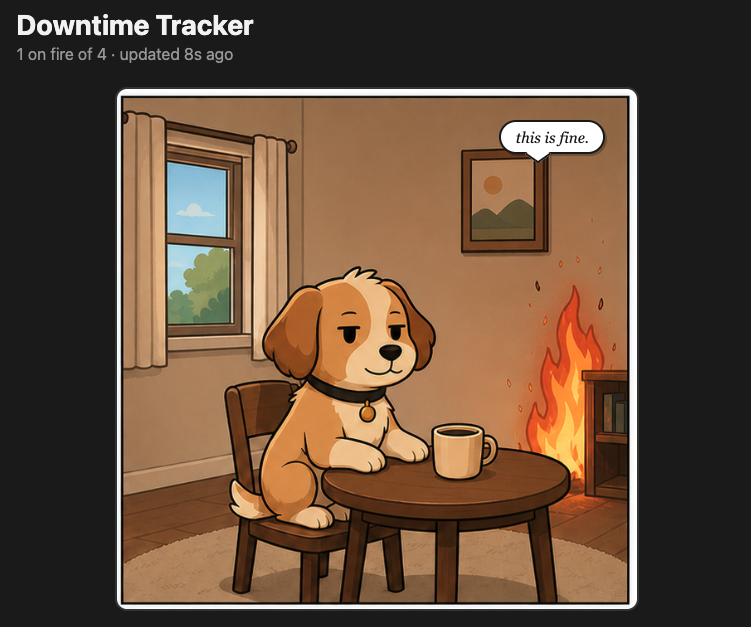

# Status tracker

A browser-only dashboard that polls the status pages of services and displays them with appropriate number of fires.



## Tracked services

- [GitHub](https://www.githubstatus.com/)
- [Claude / Anthropic](https://status.claude.com/)
- [OpenAI](https://status.openai.com/)
- [DocPlanner](https://status.docplanner.com/)

## Getting started

```bash
npm install
npm run dev
```

Open [http://localhost:5173](http://localhost:5173). The page auto-refreshes statuses every 60 seconds.

## Stack

- Vite 6 + React 19 + TypeScript 5.7
- No backend — fetches Statuspage v2 endpoints (`/api/v2/summary.json`) directly from the browser (CORS is allowed by all tracked services)

## Adding a service

Append an entry to `SERVICES` in `src/services.ts`. The service must be hosted on Statuspage so the `/api/v2/summary.json` endpoint is available.

## Build

```bash
npm run build      # typecheck + production build
npm run typecheck  # typecheck only (faster)
npm run preview    # serve dist/ locally
```

## Credits

The "this is fine" dog images were generated using [Codex](https://openai.com/codex).

## License

[MIT](LICENSE)
